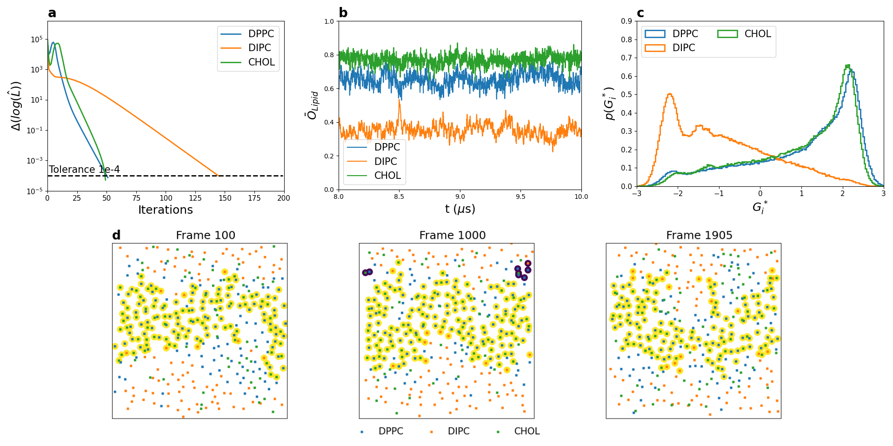

domhmm
==============================
[//]: # (Badges)

| **Latest release** | [](https://github.com/BioMemPhys-FAU/domhmm/releases)   [](https://domhmm.readthedocs.io/en/latest/?badge=latest)|
| :------ | :------- |
| **Status** | [](https://github.com/BioMemPhys-FAU/domhmm/actions?query=branch%3Amain+workflow%3Agh-ci) [](https://codecov.io/gh/BioMemPhys-FAU/domhmm/branch/main) |
| **Community** | [](https://www.gnu.org/licenses/gpl-2.0)  [![Powered by MDAnalysis](https://img.shields.io/badge/powered%20by-MDAnalysis-orange.svg?logoWidth=16&logo=data:image/x-icon;base64,AAABAAEAEBAAAAEAIAAoBAAAFgAAACgAAAAQAAAAIAAAAAEAIAAAAAAAAAAAAAAAAAAAAAAAAAAAAAAAAAAAAAAAAJD+XwCY/fEAkf3uAJf97wGT/a+HfHaoiIWE7n9/f+6Hh4fvgICAjwAAAAAAAAAAAAAAAAAAAAAAAAAAAAAAAACT/yYAlP//AJ///wCg//8JjvOchXly1oaGhv+Ghob/j4+P/39/f3IAAAAAAAAAAAAAAAAAAAAAAAAAAAAAAAAAAAAAAJH8aQCY/8wAkv2kfY+elJ6al/yVlZX7iIiI8H9/f7h/f38UAAAAAAAAAAAAAAAAAAAAAAAAAAB/f38egYF/noqAebF8gYaagnx3oFpUUtZpaWr/WFhY8zo6OmT///8BAAAAAAAAAAAAAAAAAAAAAAAAAAAAAAAAgICAn46Ojv+Hh4b/jouJ/4iGhfcAAADnAAAA/wAAAP8AAADIAAAAAwCj/zIAnf2VAJD/PAAAAAAAAAAAAAAAAICAgNGHh4f/gICA/4SEhP+Xl5f/AwMD/wAAAP8AAAD/AAAA/wAAAB8Aov9/ALr//wCS/Z0AAAAAAAAAAAAAAACBgYGOjo6O/4mJif+Pj4//iYmJ/wAAAOAAAAD+AAAA/wAAAP8AAABhAP7+FgCi/38Axf4fAAAAAAAAAAAAAAAAiIiID4GBgYKCgoKogoB+fYSEgZhgYGDZXl5e/m9vb/9ISEjpEBAQxw8AAFQAAAAAAAAANQAAADcAAAAAAAAAAAAAAAAAAAAAAAAAAAAAAAAAAAAAjo6Mb5iYmP+cnJz/jY2N95CQkO4pKSn/AAAA7gAAAP0AAAD7AAAAhgAAAAEAAAAAAAAAAACL/gsAkv2uAJX/QQAAAAB9fX3egoKC/4CAgP+NjY3/c3Nz+wAAAP8AAAD/AAAA/wAAAPUAAAAcAAAAAAAAAAAAnP4NAJL9rgCR/0YAAAAAfX19w4ODg/98fHz/i4uL/4qKivwAAAD/AAAA/wAAAP8AAAD1AAAAGwAAAAAAAAAAAAAAAAAAAAAAAAAAAAAAALGxsVyqqqr/mpqa/6mpqf9KSUn/AAAA5QAAAPkAAAD5AAAAhQAAAAEAAAAAAAAAAAAAAAAAAAAAAAAAAAAAADkUFBSuZ2dn/3V1df8uLi7bAAAATgBGfyQAAAA2AAAAMwAAAAAAAAAAAAAAAAAAAAAAAAAAAAAAAAAAAB0AAADoAAAA/wAAAP8AAAD/AAAAWgC3/2AAnv3eAJ/+dgAAAAAAAAAAAAAAAAAAAAAAAAAAAAAAAAAAAAAAAAA9AAAA/wAAAP8AAAD/AAAA/wAKDzEAnP3WAKn//wCS/OgAf/8MAAAAAAAAAAAAAAAAAAAAAAAAAAAAAAAAAAAAIQAAANwAAADtAAAA7QAAAMAAABUMAJn9gwCe/e0Aj/2LAP//AQAAAAAAAAAA)](https://www.mdanalysis.org)|

The study of lateral nano- and microdomains in biological lipid membranes is an important area in membrane biophysics.
Molecular Dynamics (MD) simulations are used to investigate these lateral heterogeneities in lipid bilayers, offering complementary insights to experimental studies by shedding light on the underlying dynamics.
However, the identification of Lo or Ld domains from coarse-grained or atomistic MD simulations still poses a huge effort for researchers during the analysis.
**DomHMM** addresses this challenge by providing a reliable and straightforward workflow (see Trollmann & Böckmann, 2024 [1]) for domain identification in membrane simulations at different levels of resolution. This open-source package is built using the cookiecutter template for [MDAKits](https://www.mdanalysis.org/2022/08/24/mdakits-intro/).

[1] M. F. W. Trollmann, R. A. Böckmann, Characterization of domain formation in complex membranes. Methods Enzymol. 701, 1–46 (2024).

DomHMM is bound by a [Code of Conduct](https://github.com/BioMemPhys-FAU/domhmm/blob/main/CODE_OF_CONDUCT.md).

Features
--------------

With DomHMM you can:

- Calculate the area per lipid for each lipid in every leaflet.
- Compute the average S<sub>CC</sub> parameter for each acyl chain of every lipid.
- Easily identify lateral nano- and microdomains in your membrane simulations.

Documentation
--------------

The documentation of DomHMM can be found [here](https://domhmm.readthedocs.io/en/latest/?badge=latest).

Installation
--------------

To build DomHMM from source,
we highly recommend using virtual environments.
If possible, we strongly recommend that you use
[Anaconda](https://docs.conda.io/en/latest/) as your package manager.
Below we provide instructions both for `conda`/`mamba` and
for `pip`.

#### Virtual environment

Ensure that you have [conda](https://docs.conda.io/projects/conda/en/latest/user-guide/install/index.html) or [mamba](https://mamba.readthedocs.io/en/latest/installation/mamba-installation.html) installed.

Create a virtual environment and activate it:

```
conda create --name domhmm
conda activate domhmm
```

Or,
```
mamba create --name domhmm
mamba activate domhmm
```

#### Installing with PyPI

DomHMM can be installed directly with pip

```
pip install domhmm
```

#### Installing directly from the repository without cloning

If you want to install the latest version of DomHMM directly from the repository (either from the `main` branch or any other branch), you can use the following command:

```
python3 -m pip install git+https://github.com/BioMemPhys-FAU/domhmm@main
```

#### Installing directly from the repository with cloning

First clone repository:
```
git clone https://github.com/BioMemPhys-FAU/domhmm
cd domhmm
```

Install the development and documentation dependencies (with conda or with mamba):

```
conda env update --name domhmm --file devtools/conda-envs/test_env.yaml
conda env update --name domhmm --file docs/requirements.yaml
```

Build this package from the source:

```
pip install -e .
```

When you are finished, you can exit the virtual environment with the following:

```
conda deactivate
```

#### With pip

To build the package from the source, run the following:

```
pip install -e .
```

If you want to create a development environment, install
the dependencies required for tests and docs with:

```
pip install -e ".[test,doc]"
```

Our test suite requires the installation of `pytest`. To install this package via `conda` or `mamba` run:

```
conda install pytest
```

Or,
```
mamba install pytest
```

To run the test, first clone the repository
```
git clone https://github.com/BioMemPhys-FAU/domhmm
```

Change into the directory and run `pytest`,

```
cd domhmm
pytest --pyargs domhmm
```

Usage
--------------

### Example Script
You can use the DomHMM library like in this example script
```
import MDAnalysis as mda
import domhmm

path2xtc = "CHANGE_IT_TO_YOUR_XTC_FILE.xtc"
path2tpr = "CHANGE_IT_TO_YOUR_TPR_FILE.tpr"
uni = mda.Universe(path2tpr, path2xtc)
membrane_select = "resname DPPC DIPC CHOL"
heads = {"DPPC": "PO4", "DIPC": "PO4"}
tails = {"DPPC": [["C1B", "C2B", "C3B", "C4B"], ["C1A", "C2A", "C3A", "C4A"]],
                 "DIPC": [["C1B", "D2B", "D3B", "C4B"], ["C1A", "D2A", "D3A", "C4A"]]}
sterol_heads = {"CHOL": "ROH"}
sterol_tails = {"CHOL": ["ROH", "C1"]}
model = domhmm.PropertyCalculation(universe_or_atomgroup=uni,
                                       leaflet_kwargs={"select": "name PO4", "pbc": True},
                                       membrane_select=membrane_select,
                                       leaflet_select="auto",
                                       heads=heads,
                                       sterol_heads=sterol_heads,
                                       sterol_tails=sterol_tails,
                                       tails=tails,
                                       result_plots=True)
model.run()
```
- In this example, there are two lipids and one sterol with automatic leaflet detection option
- Be aware the order of the tails should be the same such as `{"Lipid_1":[[Acyl_Chain_1],[Acyl_Chain_2]], "Lipid_2":[[Acyl_Chain_1],[Acyl_Chain_2]]}`
- Be aware that for sterol tails configuration first element of the array represents the head part and the second element represents the tail part
- You can change the run configuration to decide start frame, end frame, and step size such as `model.run(start=0, stop=100, step=5)`
- `membrane_select` is used to select residues of membranes. There should be no other residues besides membrane ones
- Since `result_plots` option is set to enable, intermediate plots will be shown as in the below image. 


### Copyright

The DomHMM source code is hosted at https://github.com/BioMemPhys-FAU/domhmm
and is available under the GNU General Public License, version 2 (see the file [LICENSE](https://github.com/BioMemPhys-FAU/domhmm/blob/main/LICENSE)).

Copyright (c) 2023, Marius FW Trollmann


#### Acknowledgements
 
Project based on the 
[MDAnalysis Cookiecutter](https://github.com/MDAnalysis/cookiecutter-mda) version 0.1.
Please cite [MDAnalysis](https://github.com/MDAnalysis/mdanalysis#citation) when using DomHMM in published work.